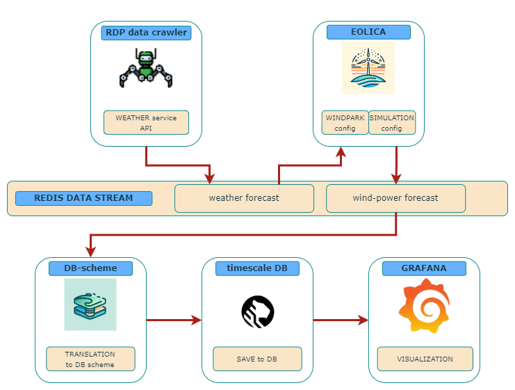

# REFORMERS Digital Twin: Wind Generation Forecasting Service

The [model for forecasting the power generation of wind turbines](https://github.com/REFORMERS-EnergyValleys/reformers-dt-wind-gen-fc-model) is deployed as part of a REFORMERS Digital Twin service.
An overview of the [RDP](https://ait-rdp.github.io/) setup used for the service is shown below.
The model itself is augmented with a data crawler for retrieving forecast data from a public weather forecast service as well as a dashboard for visualization.

## Automated Service Deployment

In addition to the service definition itself, a [DevOps configuration](./.gitlab-ci.yml) (for GitLab CI/CD) has been added.
This implements the automated deployment of the service (using the [model request file](./wind-gen-fc/model-request.yaml) and [model API helper](https://github.com/REFORMERS-EnergyValleys/reformers-dt-model-api-helper)) every time the service definition is updated (i.e., the code is tagged with a new version).
Together with the [knowledge graph database](https://github.com/REFORMERS-EnergyValleys/example-reformers-knowledge-graph) and the [Model API & Container Registry](https://github.com/REFORMERS-EnergyValleys/reformers-dt-model-api) prototype, this demonstrates the automated service deployment workflow of the REFORMERS Digital Twin technical framework.

## Funding acknowledgement

 This development has been supported by the [REFORMERS] project of the European Union’s research and innovation programme Horizon Europe under the grant agreement No.101136211.

[REFORMERS]: https://reformers-energyvalleys.eu/
